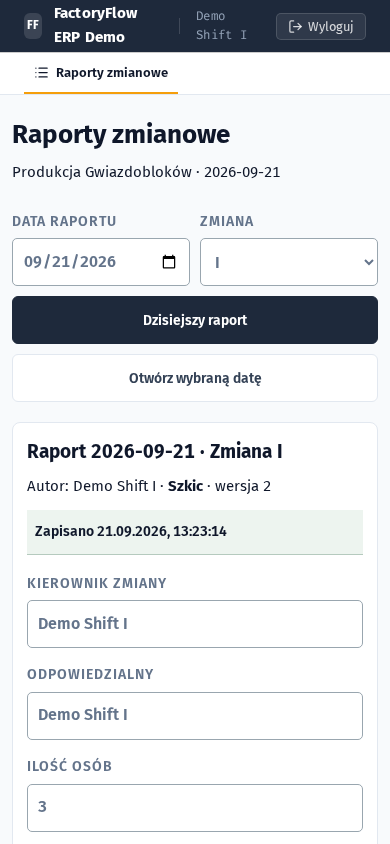
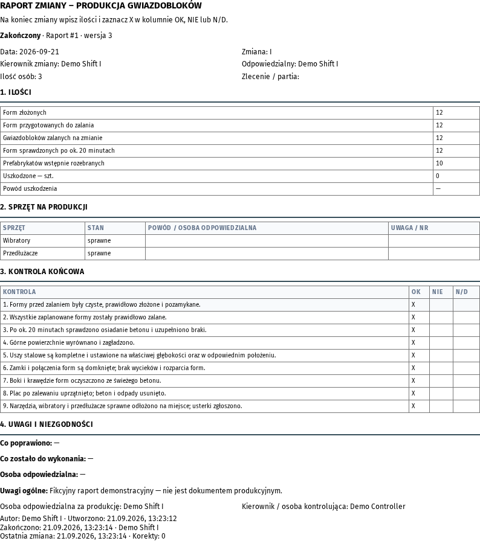

# FactoryFlow — Manufacturing ERP & Shift Reporting

A public, sanitized edition of an ERP used in a small manufacturing business. It connects office order intake, technical quotation, production handoffs and concrete-plant shift reporting in one FastAPI + Vue application.

This is a working application, not a UI mockup. The production feature snapshot was verified on **18 September 2026**. All demo identities, customer records and prices are fictional; production data and private infrastructure are excluded.

[](https://github.com/janiespalem/rcm-erp-demo/actions/workflows/ci.yml)

**FastAPI · SQLAlchemy · PostgreSQL · Alembic · Vue 3 · Docker · pytest · Playwright**

## Product tour

| Order queue | Order workspace and audit history |
| --- | --- |
|  |  |

| Mobile shift report | Finalized shift report |
| --- | --- |
|  |  |

The interface is Polish, matching the actual shop-floor workflow. Engineering notes are in English for reviewers. There is currently no hosted public demo; run the isolated version locally.

## Try it in five minutes

Start the app using Docker or the local instructions below. These are deliberately public **demo credentials**, never production credentials.

| Access type | PIN | Identity / purpose |
| --- | --- | --- |
| `biuro` | `1111` | Demo Office — intake, approvals, read-only shift history |
| `technolog` | `2222` | Demo Technologist — quotation, catalogs and report administration |
| `ceo` | `3333` | Demo CEO — analytics and report oversight |
| `produkcja` | `4444` | Demo Shift I — own drafts and corrections |
| `produkcja` | `5555` | Demo Shift II — same permissions, different author and default shift |

1. Log in as **Produkcja / 4444**. Open **Dzisiejszy raport**. Author, date and shift are prefilled.
2. Fill quantities and equipment checks. Pause to see **Zapisano**. Mark a check **NIE** to exercise the required explanation.
3. Complete remaining fields and choose **Zakończ raport**. The report locks; subsequent changes require **Koryguj raport** and a reason.
4. Inspect history, before/after audit and **Drukuj / PDF**. Resize to a phone viewport: the same workflow remains available.
5. Log in as **Biuro** to read without edit access. As **Technolog**, explore synthetic orders, quotations and the separate **Kalkulatory** tab.

Shift history starts empty so you can create your own report. Office orders and catalogs are seeded automatically.

## What I built

**Office-to-production workflow:** intake → technical triage → quotation → approval → production → delivery. Includes material/operation pricing, internal orders at cost, controlled attachments, PDF production sheets and offers, order events, archive/restore and XLSX export.

**Concrete-plant shift reporting:** one report per date and shift; individual authors; autosaved drafts; nine fixed OK / NIE / N/D checks; conditional validation for damage, equipment defects and unfinished work; finalization; reasoned corrections; role-restricted archival; phone layout and browser A4 printing.

**Production calculators:** steel-reinforcement quantities/materials and concrete-block layouts, weights and mixed-order costing. Reinforcement and the finished concrete product are different stages of the same product. Calculators remain separate from shift reports; this is not an inventory or batch-traceability system.

## Engineering decisions worth reviewing

| Problem | Implementation | Evidence |
| --- | --- | --- |
| Concurrent edits overwrite records | Optimistic versioning, HTTP 409, transactional audit | [PostgreSQL races](tests/test_postgres_concurrency.py) |
| Logout or failed autosave loses input | Pending-save guard, discard confirmation, retained form values | [Chromium report workflows](tests/test_shift_reports.py) |
| Duplicate date/shift reports | Unique database index on active reports | [Models](backend/models.py), [concurrency tests](tests/test_postgres_concurrency.py) |
| Changed questions reinterpret old answers | Immutable question schema; snapshots pin the version | [Shared schema](shared/shift-report-schemas.json), [regression tests](tests/test_shift_reports.py) |
| Autosave floods the audit trail | Same-actor draft saves coalesce; corrections/finalization stay separate | Test: **20 synthetic saves → 1 draft-save event**, retaining initial/final state and count |
| Profitability view queries once per order | Eager loading of quotations and operations | [Query-count tests](tests/test_rentownosc_queries.py) |
| Dirty files enter an exact-commit release | Archive a resolved commit, not the working directory | [Archive helper](scripts/archive-commit.sh), [release safety tests](tests/test_release_safety.py) |

These are engineering guarantees and synthetic test results, **not measured business-impact claims**. Timestamps, validation, corrections and recorded defects support later pilot evaluation. No reporting-time reduction, adoption figure or defect reduction is claimed.

## Run locally

### Docker

Requires Docker Compose. From the repository root:

```bash
JWT_SECRET="$(openssl rand -hex 32)" docker compose up --build
```

Open <http://127.0.0.1:8000>. Compose runs migrations and seeds fictional data, binding only to localhost. SQLite persists in the `demo-data` named volume; changing the secret invalidates old sessions. Never reuse demo PINs in a real deployment. Earlier demo versions used `./data`; that directory is not deleted or automatically imported.

### Python + Node

Requires Python 3.11+, Node 20+ and WeasyPrint system libraries for commercial PDFs. On Debian/Ubuntu these include `libharfbuzz-subset0`, `libharfbuzz0b`, `libpango-1.0-0` and `libpangoft2-1.0-0`; the Dockerfile installs them.

```bash
python3.11 -m venv .venv
. .venv/bin/activate
pip install -r requirements.txt -r requirements-dev.txt

cd frontend-vite
npm ci
npm run build
cd ..

APP_ENV=dev python -m alembic upgrade head
cd backend
APP_ENV=dev uvicorn main:app --host 127.0.0.1 --port 8000
```

Open <http://127.0.0.1:8000>; API documentation is at `/docs`. SQLite is the zero-setup demo default. Set `DATABASE_URL` for PostgreSQL; concurrency guarantees are tested against PostgreSQL, not inferred from SQLite.

## Verification

```bash
# Repository root, virtual environment active:
(cd frontend-vite && npm ci && npm run test:lego && npm run test:tetrapod && npm run build)
APP_ENV=test DISABLE_STARTUP_SEED=1 python -m pytest -q

python -m playwright install --with-deps chromium
APP_ENV=test DISABLE_STARTUP_SEED=1 RUN_SHIFT_BROWSER=1 python -m pytest tests/test_shift_reports.py -q
```

[CI](.github/workflows/ci.yml) runs Python tests, calculator tests, frontend builds, fresh SQLite migrations, a dedicated PostgreSQL 17 migration/concurrency job and Chromium report workflows: 360/390px phone layouts, A4, finalization and logout. Browser tests are explicitly enabled. PostgreSQL tests require an isolated database named `rcm_erp_test` and refuse other names.

## Architecture and limitations

```text
Vue browser UI → FastAPI API → SQLAlchemy → PostgreSQL / local SQLite
                       ├─ orders + quotation + document generation
                       └─ shift reports + validation + versioning + audit
shared/shift-report-schemas.json → versioned report question definitions
```

- One application and database; no separate reporting service or queue infrastructure.
- Backend authorization is authoritative; production users cannot access commercial orders.
- Reports live on the server. Calculator delivery/cart scratchpads use browser-local storage and are **not** a shared stock ledger.
- Coalesced draft audit retains initial/final states, not every intermediate keystroke.
- Shift printing uses the browser; commercial PDFs use Jinja2 + WeasyPrint.
- Report migrations explicitly refuse unsafe downgrades rather than silently moving the migration ledger.
- The standalone block calculator loads Three.js from a CDN; its 3D preview needs internet access.
- The original deployment coexists with the company's accounting system. Accounting integration and linked steel-to-concrete traceability are not implemented here.

## Public-demo boundary

No production database, customer uploads, drawings, real user accounts, commercial price list, secrets, private deployment configuration or private Git history are included. Existing demo branding and synthetic seeds are retained. Calculator prices are synthetic and labeled. Screenshots use fictional data.

This is an evaluation app, not an internet-facing production template: public PINs grant write access, with no per-visitor isolation or automatic resets. Keep it local or deploy only in a disposable, isolated environment.
