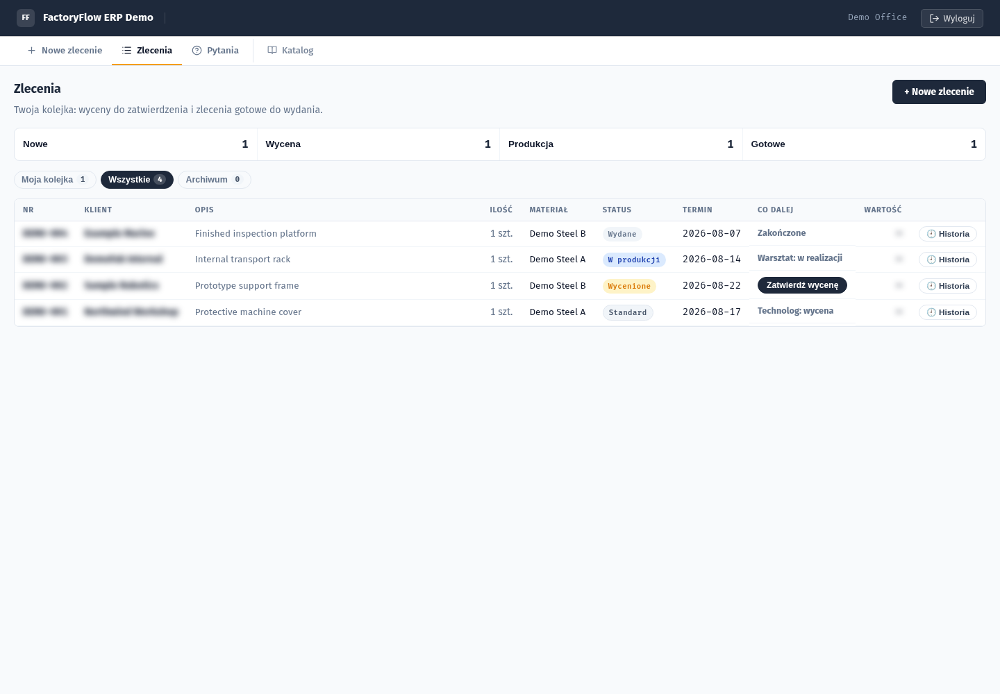
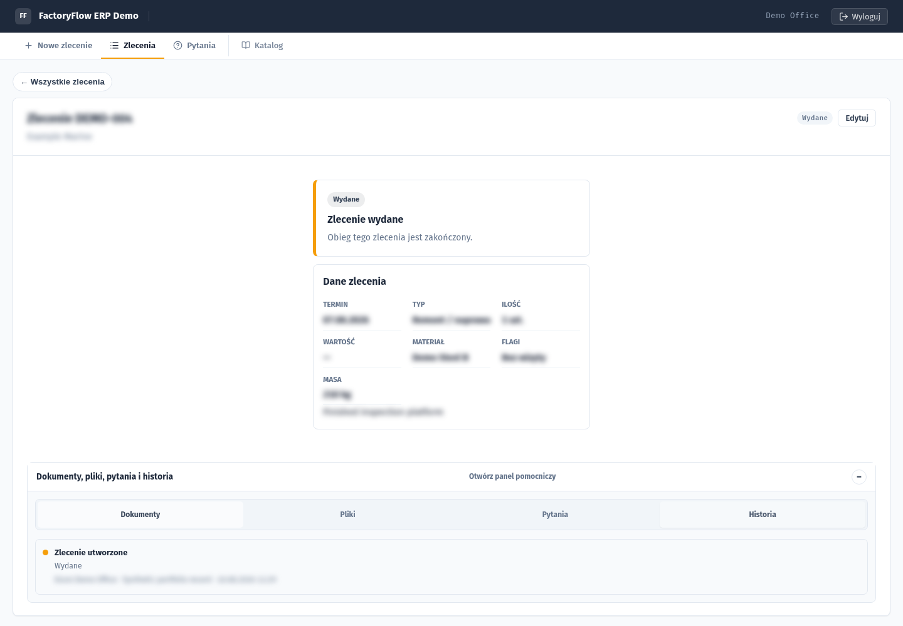
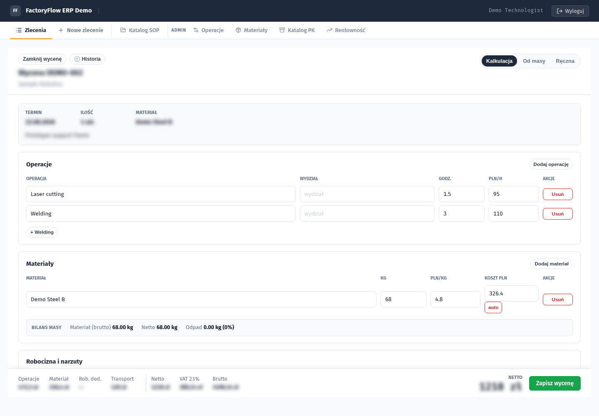
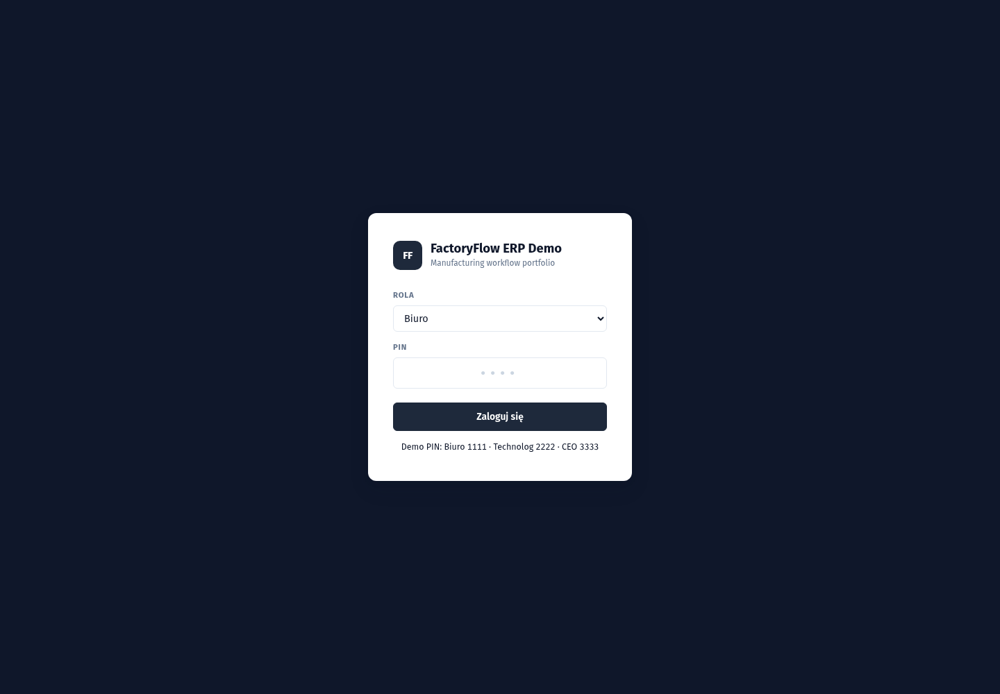

# FactoryFlow ERP Demo

A sanitized portfolio version of a production-oriented ERP/CPQ application for a small manufacturing company. The interface is in Polish because it models a real shop-floor workflow; every record, identity, price, contact, and document in this repository is synthetic.

```text
request → triage → quotation → approval → production → delivery → history
```

[](https://github.com/fearlesstilted/rcm-erp-demo/actions/workflows/ci.yml)

## Product tour

| Orders and role-aware work queue | Order workspace and audit history |
| --- | --- |
|  |  |

| Structured quotation | Demo login |
| --- | --- |
|  |  |

## What it demonstrates

- Role-based workflows for `biuro`, `technolog`, and `ceo`.
- Order intake with materials, dimensions, weight, delivery details, and restricted-project marking.
- Technical triage and a simplified order lifecycle with clear next actions.
- CPQ quotation by materials, operations, weight, overhead, margin, and transport.
- Internal orders calculated at cost and external orders requiring office approval.
- Production sheets and commercial offers generated from Jinja2 templates with WeasyPrint.
- Attachments with signature/MIME validation, controlled download, and audit attribution.
- Order history, archive/restore, production queue, schedule, analytics, and XLSX export.
- Alembic migrations, database-backed bcrypt PIN authentication, JWT authorization, and role checks.

## Demo access

The local seed creates three public demonstration identities:

| Role | PIN | Typical view |
| --- | --- | --- |
| `biuro` | `1111` | New requests, approvals, customer communication |
| `technolog` | `2222` | Triage, quotation, production and catalogs |
| `ceo` | `3333` | Analytics, schedule and all orders |

These credentials are intentionally public and must never be reused outside this demo.

## Stack

| Layer | Technology |
| --- | --- |
| Backend | Python 3.11, FastAPI, SQLAlchemy 2 |
| Database | SQLite for local demo, PostgreSQL-compatible configuration |
| Migrations | Alembic |
| Frontend | Vue 3, Vite, Lucide icons |
| Documents | Jinja2, WeasyPrint, pypdf, openpyxl |
| Verification | pytest, frontend production build, GitHub Actions |

## Run locally

```bash
python3.11 -m venv .venv
. .venv/bin/activate
pip install -r requirements.txt -r requirements-dev.txt

cd frontend-vite
npm ci
npm run build
cd ..

APP_ENV=dev python -m alembic upgrade head
cd backend
APP_ENV=dev uvicorn main:app --host 127.0.0.1 --port 8000
```

Open <http://127.0.0.1:8000>. On first start, the application creates only the synthetic records defined in `backend/seed.py`.

Docker is also supported:

```bash
JWT_SECRET="$(openssl rand -hex 32)" docker compose up --build
```

## Verification

```bash
cd frontend-vite && npm ci && npm run build && cd ..
APP_ENV=test DISABLE_STARTUP_SEED=1 python -m pytest -q
DATABASE_URL=sqlite:////tmp/factoryflow-migration.db APP_ENV=test python -m alembic upgrade head
```

## Architecture

```text
backend/
  main.py                 FastAPI composition, login, health, SPA serving
  models.py               SQLAlchemy domain model
  routers/                Orders, quotes, documents, catalogs, analytics
  services/               Workflow and pricing rules
  seed.py                 Synthetic portfolio dataset
frontend-vite/src/
  components/             Role-aware application and workspaces
  composables/            API, auth and shared state
  utils/                  Formatting and workflow presentation
migrations/               Alembic revision chain
templates/                Production sheet and quotation HTML
tests/                    API, security, pricing, workflow and migration checks
```

## Sanitization boundary

This repository intentionally contains no real customer records, company identifiers, prices, drawings, PDFs, uploads, database files, credentials, deployment configuration, server details, audit reports, or private repository history. Screenshots are generated locally from the same synthetic seed used by the code.
